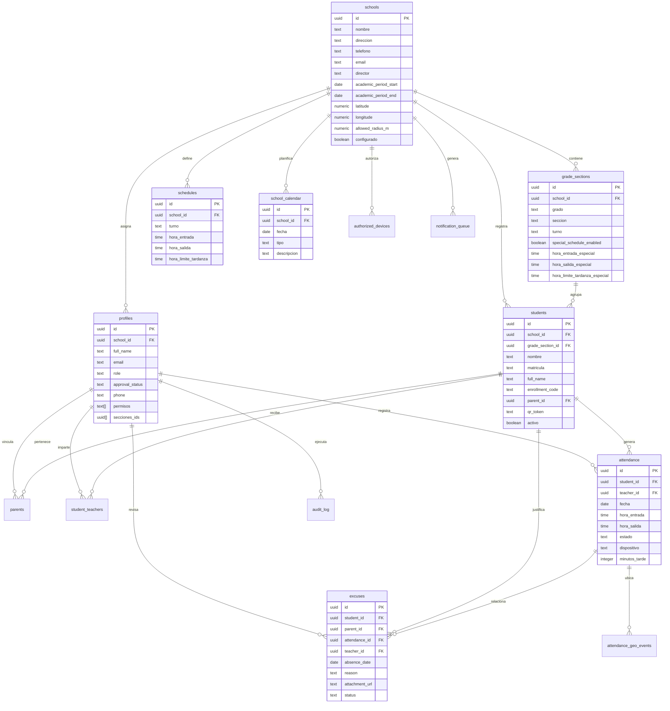

# Diagrama de Base de Datos

Proyecto: QHere - Control de Asistencia Escolar

## Notas tecnicas

- `profiles` se relaciona con Supabase Auth por medio de `auth.users(id)`.
- `students.qr_token` identifica el QR unico de cada estudiante.
- `attendance` registra entrada, salida, tardanza, dispositivo y relacion con docente.
- `audit_log` conserva trazabilidad de acciones sensibles.
- `authorized_devices` y `attendance_geo_events` cubren control de dispositivo y ubicacion.
